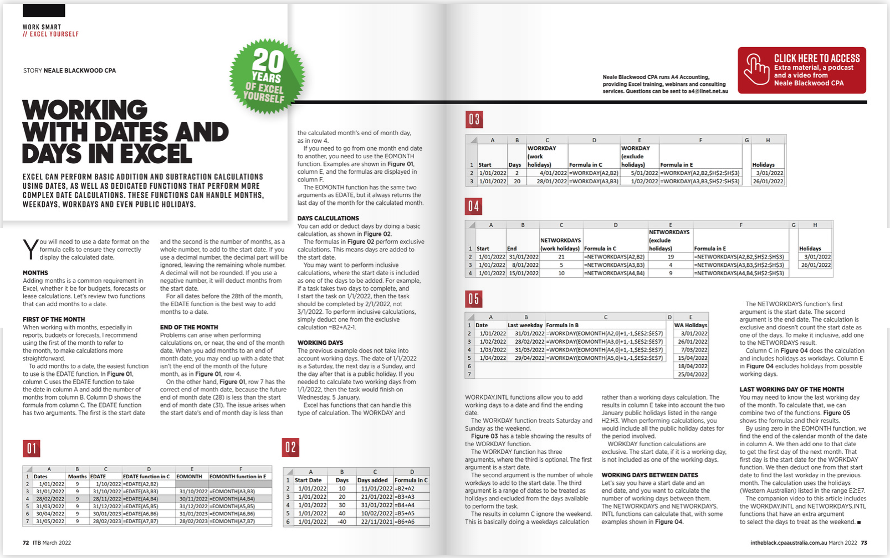

```{r echo=FALSE}
library(tidyverse)
library(lubridate)
```

The current tutorial is inspired by the current (March) issue of the CPA Australia journal [#InTheBlack](https://intheblack.cpaaustralia.com.au/) which demonstrates how to use date formats in Excel. An image below is a snippet of the article. 

{width="50%"}

I thought it is a good idea to write a tutorial to show how the same approach can be used in R. Leaving judgements on appropriateness of either, Excel or R for the task on hand, let's dig into this.

We are going to work with a dataset of transactions from Kaggle. 


```{r}
plot(cars)
```


