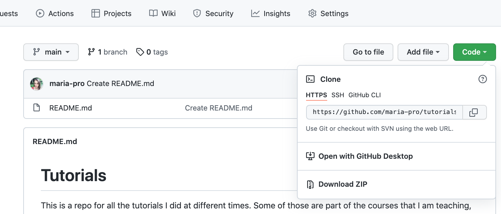
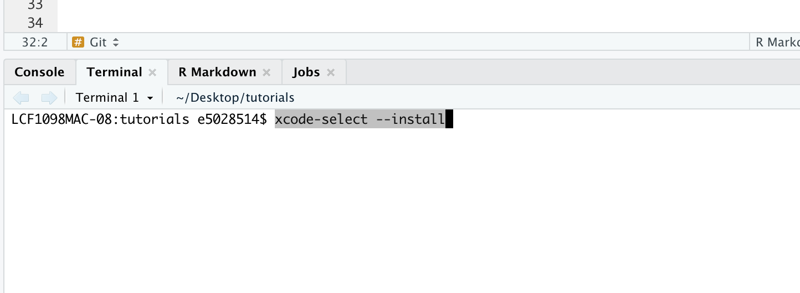
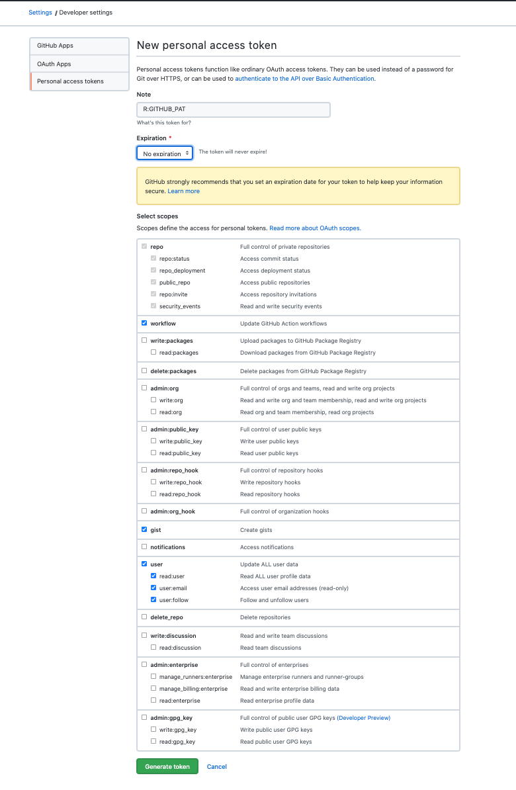

```{r setup, include=FALSE}
knitr::opts_chunk$set(echo = TRUE)
```

***

**Resources**

I highly recommmend [this](https://happygitwithr.com/) book by Jenny Brian, but.. as always... we do not have time for *long* books and prefer some simple steps to complete. Nice and easy


## Github

1. Create your github profile [here](https://github.com/)

2. If eligible, sign up for Student's benefits called [GitHub Student Developer Pack](https://education.github.com/pack) - lots of goodies there!

3. Create your repository and copy your "Code"

{width="70%"}


##  Git

1. If you are on **Windows**: install [this](https://gitforwindows.org/)

If you are on **Mac**: go to RStudio and **Terminal** tab and type:

`xcode-select --install`

{width="70%"}

2. Introduce yourself to Git:

In your Rstudio, go to **Terminal** and type

`git config --global user.name "My Name To Use"`

`git config --global user.email "myemail@gmail.com"`

**IMPORTANT**: Replace ***'My Name To Use'*** with ***YOUR ACTUAL NAME*** but keep ' ' 

and ***'myemail@gmail.com'*** with your git email


## RStudio

1. In your RStudio create a new Project and use Version Control and Git (NOT New Directory)

Put your link you copied from `Github Code` 

2. In your RStudio CONSOLE (not Terminal) type:

`install.packages("usethis")`

`usethis::create_github_token()`



In the new browser window agree to all selected and SAVE. This will generate your **PAT** (Personal Access Token) = a security measure introduced by Github.

Make sure that your COPY your PAT in that browser window!

4. Go back to your RStudio and in your **CONSOLE** (not Terminal) type:

`install.packages("gitcreds")`

`gitcreds::gitcreds_set()` 

And you are DONE!


